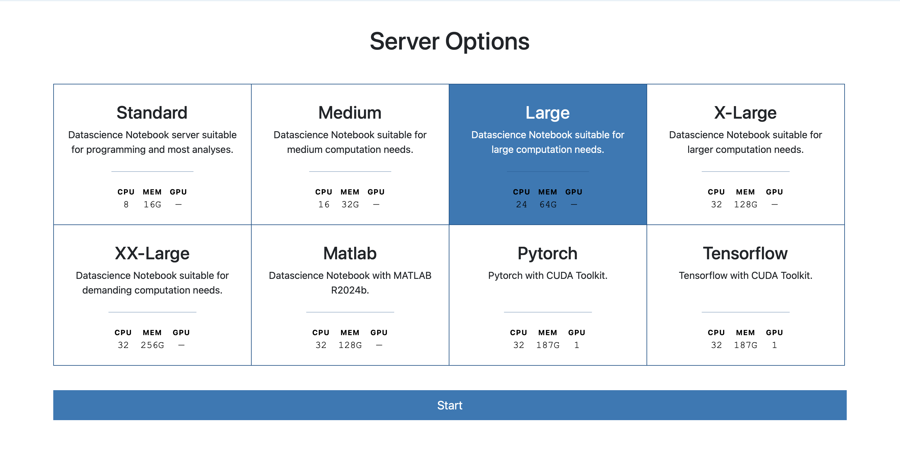
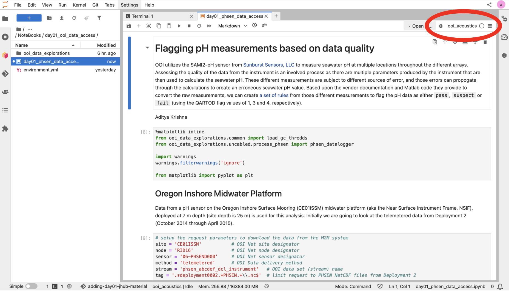

# Setting up the JupyterHub environment

## Log on the OOI JupyterHub
Access to the NSF OOI JupyterHub is available to researchers and students looking to interact with OOI data. [JupyterHub]((https://jupyterhub.readthedocs.io/en/latest/)) creates encapsulated [JupyterLab](https://jupyterlab.readthedocs.io/en/latest/) environments unique to each user.

The JupyterHub is set up to provide users with the option of using the following programming languages:
- [Python](https://www.python.org/)
- [R](https://www.r-project.org/)
- [MATLAB](https://www.mathworks.com/products/matlab.html) (users need to provide their own individual or institutional license for [MATLAB](https://www.mathworks.com/products/matlab.html))
- [Julia](https://julialang.org/)

Users can explore and analyze OOI data using a high-performance computing cluster co-located with the data (both the [raw](https://rawdata.oceanobservatories.org/files/) and processed [netCDF](https://www.unidata.ucar.edu/software/netcdf/) files, which are also accessible via the [OOI Gold Copy THREDDS catalog](https://thredds.dataexplorer.oceanobservatories.org/thredds/catalog/ooigoldcopy/public/catalog.html)).

You can login to the OOI JupyterHub at https://jupyter.oceanobservatories.org using [CILogon](https://cilogon.org/) with your email account and the appropriate identity provider (use the drop-down menu to select your institution, and Log In). You will need to login using your home organization’s credential system.

The next step is to choose the server size and type. Choose "Large" for the summer school:

```{image} ./img/jhub_server_sizes.png
:width: 800px
:align: center
```

<figure>
  
</figure>
<br/><br/>

At this point, you should see a screen that looks like the one below. From the Launcher tab, select the “Terminal” launcher under the “Other” category. This is a Linux terminal running the bash shell which will be used extensively in the following steps.

<figure>
  
</figure>


## Clone the summer school repository

The OOI Summer School on Acoustics will be sharing materials via a [GitHub repository](https://github.com/oceanobservatories-community/2025-Summer-School-Acoustics). Here we will be providing notebooks and instructions for participants to follow along. To download this repository into JupyterHub, we will use the `git clone` command. 

First, go to the summer school [repository](https://github.com/oceanobservatories-community/2025-Summer-School-Acoustics) and copy the URL by clicking the green `<> Code` button on the repo home page.
<figure>

</figure>

Then open the JupyterHub terminal and run the commands below to 1) download the GitHub repository and 2) navigate into the downloaded repository. 
```bash
git clone https://github.com/oceanobservatories-community/2025-Summer-School-Acoustics.git
cd 2025-Summer-School-Acoustics
```


## Set up `conda`

[Conda](https://docs.conda.io/projects/conda/en/stable/user-guide/getting-started.html) (or its recent cousin, [Mamba](https://mamba.readthedocs.io/en/latest/)) is an environment manager we will be using for this summer school. Using conda has the following benefits:
- Isolation of dependencies
- Reproducibility
- Ease of management
- Testing and development

To know more about `conda` and why we recommend it, visit Anaconda's [documentation](https://www.anaconda.com/docs/tools/working-with-conda/environments#why-should-i-create-a-new-environment%3F) which dives into the following benefits:
- Isolation of dependencies
- Reproducibility
- Ease of management
- Testing and development

The OOI JupyterHub requires some initial setup to make `conda` works. This setup **only need to be completed once**.

The steps can be completed by running the `init_conda.sh` script:
- In the JupyterHub terminal, navigate to the `scripts/` directory in the cloned summer school repository. (Assuming that you are already in the repository type `cd scripts` in the terminal)
- Run the initialization script
  ```bash
  bash init_conda.sh
  ```

```{admonition} What's in the script?
:class: dropdown
This bash script does the following:
- Initializes bash by running the .bashrc file
- Set terminal to run .bashrc at every start
- Configure .condarc so it remembers and saves custom user environments
```


## Create a `conda` environment

Now we will create a `conda` environment to run a test notebook that will load data from the [OOI Gold Copy THREDDS
catalog](https://thredds.dataexplorer.oceanobservatories.org/thredds/catalog/ooigoldcopy/public/catalog.html). By creating an environment with specific packages, we make sure that we have all the required packages to run the example notebook, and that all the specified packages can work with each other (i.e., no dependency conflicts).

In the JupyterHub terminal:
- Navigate to the `environment.yml` file in the summer school repository and run the following command. This will take some time. Type `y` and hit `ENTER` when prompted if you want to install any packages.

  ```bash
  cd ~/2025-Summer-School-Acoustics/NoteBooks/day01_ooi_data_access
  conda env create -f environment.yml
  ```
- After the environment has been created, `activate` it
  ```bash
  conda activate ooi
  python -m ipykernel install --user --name=ooi
  ```
- Register the environment as a Jupyter kernel
  ```bash
  conda activate ooi
  python -m ipykernel install --user --name=ooi
  ```


## Set up OOI data access credentials
In order to access data and/or metadata (e.g., calibration coefficients) collected from the OOI, we need to set up our access credentials. This setup **only need to be completed once**.
- If you haven't already done so, either create a user account on the [OOI Data Portal](https://ooinet.oceanobservatories.org/) (original OOI website and API server for the OOI M2M system), or use the [CILogon](https://cilogon.org/) button with an academic or Google account (login button is towards the upper right corner of the web page) to login to the portal.
- After you login, the “Log In” text will change to your username.
- Click on your username and then on the “User Profile” element of the drop down.
- Copy and save the following values from the user profile: `API Username` and `API Token`.

We will next create a `.netrc` file in our home directory to store these access credentials. Set up these access credentials by running the `setup_ooi_creds.sh` script.

In the JupyterHub terminal:
- Navigate to the `scripts/` directory in the cloned summer school repository
- Edit the `setup_ooi_creds.sh` script to replace `API_Username` and `API_Token` with your copied values from above. The `nano` command will help you edit
  ```bash
  nano setup_ooi_creds.sh
  ```
- Run the OOI access credentials setup script
  ```bash
  bash setup_ooi_creds.sh
  ```

Now we can run the provided example notebook within the `ooi-data-explorations` folder to see if all the packages have been installed properly. On the JupyterHub, use the navigation window on the left to find and open the `day01_phsen_data_access.ipynb` notebook.

When you open a jupyter notebook, on the top right you can select the ipython kernel to be the conda environment that we just created. Click on `Python 3 (ipykernel)` and change it to the `ooi` environment we just created.
<figure>

</figure>
<br/><br/>

Jupyter notebooks allow users to have cells containing Markdown notes along with cells containing code and code outputs. Each of these can be minimized or expanded. Let's all add our names to the top of the notebook by creating a Markdown cell.

This example notebook simply loads and plots data from the [OOI Gold Copy THREDDS catalog](https://thredds.dataexplorer.oceanobservatories.org/thredds/catalog/ooigoldcopy/public/catalog.html). The data is stored [here](https://thredds.dataexplorer.oceanobservatories.org/thredds/catalog/ooigoldcopy/public/CE01ISSM-RID16-06-PHSEND000-telemetered-phsen_abcdef_dcl_instrument/catalog.html?dataset=ooigoldcopy/public/CE01ISSM-RID16-06-PHSEND000-telemetered-phsen_abcdef_dcl_instrument/deployment0002_CE01ISSM-RID16-06-PHSEND000-telemetered-phsen_abcdef_dcl_instrument_20141010T183039-20150411T233350.nc) which is data from a pH sensor on the Oregon Inshore Surface Mooring (CE01ISSM) midwater platform (aka the Near Surface Instrument Frame, NSIF), deployed at 7 m depth (site depth is 25 m). Furthermore, this is telemetered data from Deployment 2 (October 2014 through April 2015). 
