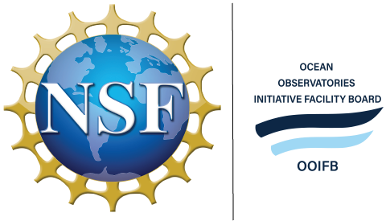

# OOI 2025 Summer School on Acoustics



```{warning}
👷 This repo is under construction. Come back soon!
```

```{include} ../readme.md
:start-after: <!-- SPHINX-START -->
```

```{admonition} Start Here
:class: note
We've provided a guide for setting up the Jupyter Hub environment and installing all the dependencies that you'll need. See {doc}`getting_started`
```
## Curriculum

The agenda for the summer school can be found [here](https://docs.google.com/document/d/1Be6sk57svMl0TdsAXNLmgmegXWCvO56QLUQe9n24Xyk/edit?usp=sharing).

All ipython notebooks used in the school can be found in the [NoteBooks](https://github.com/oceanobservatories-community/2025-Summer-School-Acoustics/tree/main/NoteBooks) directory of the repository.


## Resources
Reading material for the summer school and helpful resources for coding

```{admonition} Google Drive
:class: note
Slides and Reading material will be on the [google drive](https://drive.google.com/drive/folders/1mbkL9T2o9P4MHjQIOuxJgNdXby3lGmbm?usp=drive_link)
```

### Python
- [Plotting and Programming in Python](https://swcarpentry.github.io/python-novice-gapminder/index.html)
- [Programming with Python](https://swcarpentry.github.io/python-novice-inflammation/06-files.html)
- [Project Pythia](https://projectpythia.org/)

### Bioacoustics
- [Discovery of Sound in the Sea](https://dosits.org/)
- [Bioacoustics on StackExchange](https://bioacoustics.stackexchange.com/)
- [Watkins marine mammal sound database](https://cis.whoi.edu/science/B/whalesounds/index.cfm)
- [Orcasound learning resources](https://orcasound.net/learn)

## Website Contents
```{toctree}
:maxdepth: 2

self
jhub_setup
curriculum
```

## Module Documentation Contents
```{toctree}
:caption: API
:maxdepth: 2
summer_school_modules
```

## Acknowledgments
The NSF Ocean Observatories Initiative is a major facility sponsored by the U.S. National Science Foundation (NSF) under Cooperative Agreement No. 2244833. The summer school is organized by the OOI Facility Board with funding from NSF (award no 2434964).